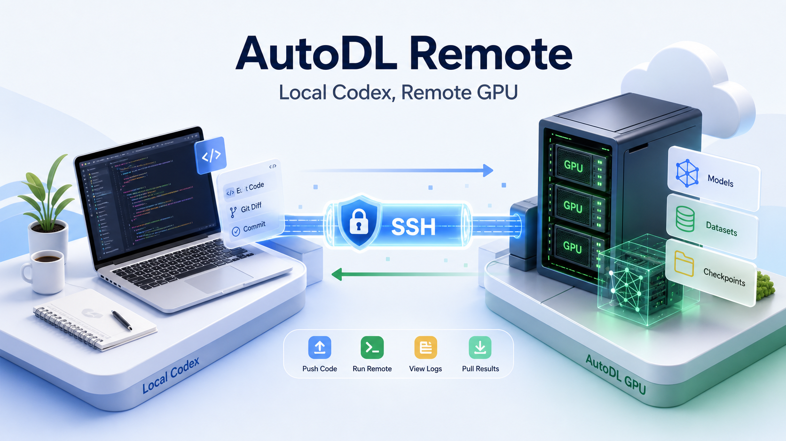
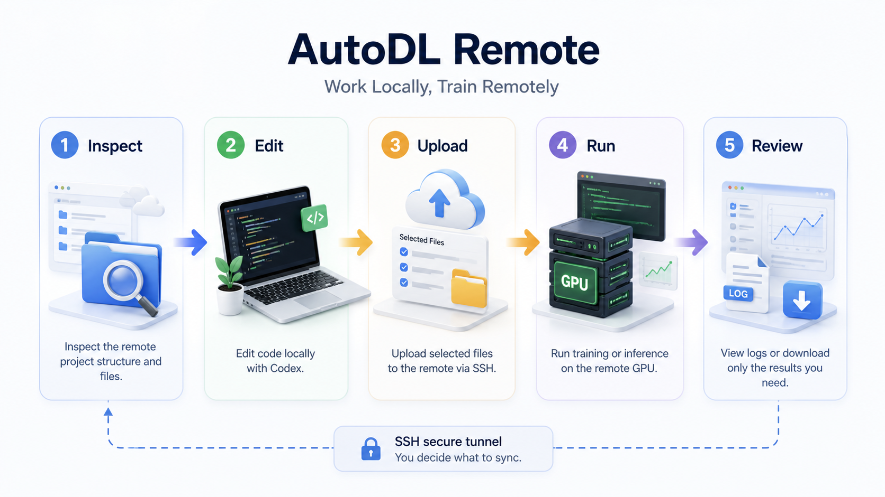
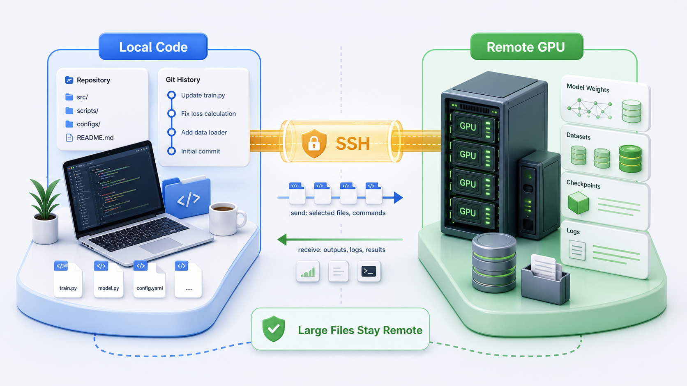

<div align="right">
  中文 | English planned
</div>

<div align="center">
  
  <h1>AutoDL Remote</h1>
  <h3>让 Codex 留在本地，让 GPU 在远端跑</h3>
  <p><em>一个面向 Codex App 的极简 SSH 插件：账号管理、远端命令、显式上传和下载。</em></p>
  <p>
    
    
    
    
    
  </p>
</div>

---

## 🎯 项目介绍

&emsp;&emsp;AutoDL Remote 的目标很直接：**Codex 在本地写代码，远端 GPU 机器负责运行代码；需要什么文件，就显式上传或下载什么文件。**

&emsp;&emsp;做 LLM、深度学习、论文复现实验时，模型权重、数据集、checkpoint 往往都在 AutoDL 这类远端 GPU 环境里。本地电脑不适合下载大模型，直接在远端安装和登录 Codex 又容易遇到代理、浏览器登录、环境配置等问题。

&emsp;&emsp;这个插件选择更简单的路线：远端不需要安装 daemon，不需要运行服务，只要能 SSH 登录即可。Codex 仍然在本地工作，本地保留代码修改痕迹和 Git diff；远端负责执行训练、推理和查看日志。

> **一句话理解：** AutoDL Remote 不是同步框架，而是给 Codex 用的一组 SSH 原语。

## ✨ What You Get

| 能力 | 说明 |
| --- | --- |
| 🔐 SSH 账号管理 | 支持保存多个远端账号，项目里只引用账号名，不写密码 |
| 📁 项目绑定 | 当前本地目录绑定到一个具体远端目录，例如 `/root/autodl-tmp/my-project` |
| 🖥️ 远端命令 | 用 `exec` 在远端运行训练、推理、环境检查等命令 |
| ⬆️ 显式上传 | 用 `put` 或 `sync-up` 把本地改过的文件送到远端 |
| ⬇️ 显式下载 | 用 `get` 或 `sync-down` 只拉回需要查看或提交的结果 |
| 📜 日志查看 | 用 `tail` 查看远端训练日志，不必下载大文件 |
| 🧾 Job 状态 | 用 `job status` 和 `job tail` 跟踪 `exec --detach --name` 创建的长任务 |
| 🧵 tmux 后端 | 可选用 `exec --tmux` 让长任务保留远端终端 pane，方便 dashboard 展示现场输出 |
| 📊 Dashboard | 用只读页面查看多台远端设备、run 状态、最近日志或 tmux pane 输出 |
| 🧠 脚本执行 | 用 `exec --script` 或 `exec --stdin` 避免复杂 quoting |
| ⏻ 远端关机 | 用 `shutdown` 处理 AutoDL 关机和 SSH 断开返回码 |
| 📝 项目约定 | 首次使用自动生成 `.autodl-remote/CONVENTIONS.md` 记录远端约定 |
| 🧩 Codex 友好 | 插件不替你判断同步策略，把决策权留给用户和 Codex |

## 🆕 0.8.0 更新

&emsp;&emsp;这版重点补上了多机训练时最需要的“现场感”：

- 新增可选 `tmux` 后端：长任务可以用 `exec --tmux --name <run> -- ...` 跑在远端 tmux pane 里。
- 新增 `tmux check/install/list/capture/attach-cmd/kill`，Codex 可以检查、安装、查看和结束远端 tmux 会话。
- Dashboard 现在优先展示 tmux pane 的真实终端输出；如果 pane 不存在，再回退到日志文件。
- `dashboard --watch` 不再整页刷新，而是轮询旁边的状态文件并增量更新页面内容，滚动体验更稳定。
- 已用一台 GPU AutoDL 和一台 CPU AutoDL 做过双机 smoke test：分别启动 tmux 任务、打开 fleet dashboard、观察实时输出，最后用 `shutdown` 关机。
- 新增开发脚本 `scripts/dev-install-cache.sh`，用于把当前源码直接刷新到 Codex App 本地插件 cache。

## ✅ Requirements

- Codex App，或支持插件 marketplace 的 Codex CLI。
- 本机需要 `bash`、`ssh`、`scp`。
- 可选安装 `rsync`，目录同步会更快；没有 `rsync` 时仍可使用 `scp`。
- 远端机器只需要能 SSH 登录，不需要安装 Codex、Python 包、OpenAI key 或额外 daemon。
- 可选远端安装 `tmux`，仅在使用 `exec --tmux` 或 tmux pane dashboard 时需要。
- 如果使用密码登录，macOS 上可以选择把密码保存到 Keychain，方便 Codex 非交互运行命令。

## 📦 Install

### Option A: Codex App 安装

1. 打开 Codex App。
2. 进入 `插件` 页面。
3. 点击右上角 `管理` 或插件来源下拉框。
4. 选择 `+ 添加更多`。
5. 添加这个 GitHub 仓库，或添加你本地 clone 后的仓库根目录。

仓库地址：

```text
https://github.com/haibarazz/AutoDL-Remote
```

如果选择本地目录，应该选择仓库根目录：

```text
/path/to/AutoDL-Remote
```

不要选择插件子目录：

```text
/path/to/AutoDL-Remote/plugins/autodl-remote
```

Codex App 会在仓库根目录读取：

```text
.agents/plugins/marketplace.json
```

添加 marketplace 后，在插件列表里选择 `AutoDL Remote` 并安装/启用。

### Option B: Codex CLI marketplace

如果你的 Codex CLI 支持插件命令，可以使用 GitHub shorthand：

```bash
codex plugin marketplace add haibarazz/AutoDL-Remote
```

然后在 Codex App 的插件页面安装，或用你的 Codex 插件管理入口安装 `AutoDL Remote`。

### Install CLI command

AutoDL Remote 的实际 SSH 操作由本地 `autodl-remote` CLI 完成。clone 仓库后运行：

```bash
git clone https://github.com/haibarazz/AutoDL-Remote.git
cd AutoDL-Remote
./scripts/install-cli.sh
```

默认会创建软链接：

```text
/opt/homebrew/bin/autodl-remote
```

也可以指定安装目录：

```bash
./scripts/install-cli.sh ~/.local/bin
```

验证 CLI 是否可用：

```bash
autodl-remote --help
```

## 🚀 Quick Start

### 1. 添加远端账号

密码登录：

```bash
autodl-remote account add autodl-gpu \
  --target root@connect.example.com \
  --port 2222 \
  --auth prompt \
  --default-remote /root/autodl-tmp
```

SSH key 登录：

```bash
autodl-remote account add gpu-key \
  --target root@host \
  --port 22 \
  --key ~/.ssh/id_rsa \
  --auth ssh-key
```

查看和选择账号：

```bash
autodl-remote account list
autodl-remote account use autodl-gpu
autodl-remote account test autodl-gpu
```

### 2. 绑定当前项目

```bash
cd /path/to/local/project
autodl-remote bind --account autodl-gpu --remote /root/autodl-tmp/my-project
autodl-remote doctor
```

项目配置会写入当前目录：

```bash
ACCOUNT="autodl-gpu"
REMOTE_ROOT="/root/autodl-tmp/my-project"
```

密码不会写入项目配置。

### 3. 让 Codex 使用插件

在 Codex 对话里可以这样说：

```text
使用 AutoDL Remote，帮我检查当前项目是否已经绑定远端，并运行 doctor。
```

```text
使用 AutoDL Remote 查看远端目录结构，不要下载模型、数据集或 checkpoint。
```

```text
我已经在本地改好了 train.py。使用 AutoDL Remote 上传这个文件到远端，然后在远端运行训练并 tail 日志。
```

安装成功后，Codex 应该能使用插件技能 `autodl-remote:autodl-remote`，并通过 `autodl-remote` CLI 执行 SSH、上传、下载和远端命令。

## 🧪 First Run

第一次建议只做无破坏检查：

```bash
autodl-remote doctor
autodl-remote model-dir
autodl-remote tree . --depth 2
autodl-remote exec -- pwd
autodl-remote exec -- nvidia-smi
```

`model-dir` 会输出项目默认模型目录；第一次执行项目命令时，本地还会自动生成 `.autodl-remote/CONVENTIONS.md`，用来记录模型目录、数据目录、运行命令等项目约定。

如果这几步正常，再开始上传代码或运行训练。

## 🧠 工作原理

<div align="center">
  
</div>

&emsp;&emsp;典型流程是：先查看远端项目结构，再把需要编辑的脚本拉到本地；Codex 在本地修改后，显式上传对应文件；训练或推理在远端执行；最后只查看日志或拉回必要结果。

<div align="center">
  
</div>

&emsp;&emsp;这个边界很重要：**本地负责代码和修改痕迹，远端负责大模型、数据集、checkpoint 和 GPU 任务。** 插件不会默认下载模型权重，也不会默认把整个远端目录同步回来。

## 📊 Dashboard

<div align="center">
  
</div>

&emsp;&emsp;Dashboard 是只读的本地页面：它通过 SSH 轮询远端状态，显示设备在线情况、GPU/磁盘信息、当前 run，以及远端日志的最近若干行。对于 `exec --tmux` 启动的任务，它会优先展示 tmux pane 的当前输出；pane 不可用时再回退到日志文件。Codex 只需要启动 dashboard 命令，不需要把训练日志复制到聊天里。

```bash
autodl-remote dashboard --fleet llm-exp --open --watch 5 --lines 120
```

&emsp;&emsp;为了让 dashboard 更有用，运行脚本建议输出结构化日志，例如 `[START]`、`[ENV]`、`[PROGRESS]`、`[METRIC]`、`[OUTPUT]`、`[DONE]`。Python 任务建议使用 `PYTHONUNBUFFERED=1 python -u ...`，这样日志能更快出现在页面里。

## 🛠️ Commands

| 命令 | 用途 |
| --- | --- |
| `autodl-remote doctor` | 检查当前项目绑定、SSH 连通性、远端目录 |
| `autodl-remote tree . --depth 2` | 查看远端目录结构 |
| `autodl-remote ls .` | 查看远端目录 |
| `autodl-remote cat -- train.py` | 查看远端文件内容 |
| `autodl-remote get train.py train.py` | 把远端文件拉到本地 |
| `autodl-remote put train.py train.py` | 把本地文件上传到远端 |
| `autodl-remote put-run train.py -- python train.py` | 先上传文件，再执行远端命令 |
| `autodl-remote sync-up ./src src` | 上传本地目录 |
| `autodl-remote sync-down outputs outputs` | 下载远端目录 |
| `autodl-remote exec -- python train.py` | 在远端执行命令 |
| `autodl-remote exec --script scripts/check.sh` | 上传并运行本地脚本，减少 shell quoting 问题 |
| `cat script.sh \| autodl-remote exec --stdin -- bash` | 从 stdin 上传多行脚本并运行 |
| `autodl-remote exec --detach --name train -- python train.py` | 远端后台运行长任务 |
| `autodl-remote tmux check` | 检查远端是否安装 tmux |
| `autodl-remote exec --tmux --name train -- python -u train.py` | 用 tmux pane 运行长任务 |
| `autodl-remote tmux capture train --lines 200` | 抓取 tmux pane 最近输出 |
| `autodl-remote job list` | 列出本地记录的远端长任务 |
| `autodl-remote job status train` | 查看长任务 PID、日志、远端状态和退出码 |
| `autodl-remote job tail train` | 查看命名长任务日志 |
| `autodl-remote fleet status exp` | 查看多台远端设备状态 |
| `autodl-remote dashboard --fleet exp --watch 5 --lines 120` | 打开只读 dashboard，持续展示远端状态和日志 |
| `autodl-remote model-dir --mkdir` | 输出并创建项目模型目录 |
| `autodl-remote shutdown` | 请求远端关机，并把 SSH 断开视为可能成功 |

## 📌 Usage Patterns

### 远端已有项目

```bash
autodl-remote tree . --depth 2
autodl-remote cat -- train.py
autodl-remote get train.py train.py

# Codex 在本地修改 train.py
autodl-remote put-run train.py -- python train.py
```

### 复杂脚本或 heredoc

```bash
autodl-remote exec --script scripts/remote_metrics.sh

cat <<'SH' | autodl-remote exec --stdin -- bash
set -euo pipefail
pwd
python - <<'PY'
print("remote python ok")
PY
SH
```

### 本地已有项目

```bash
autodl-remote bind --account autodl-gpu --remote /root/autodl-tmp/my-project
autodl-remote sync-up ./src src
autodl-remote put-run train.py -- python train.py
```

### 远端训练任务

```bash
autodl-remote exec --detach --name train -- python train.py
autodl-remote job status train
autodl-remote job tail train
autodl-remote cat -- outputs/metrics.json
autodl-remote get outputs/metrics.json outputs/metrics.json
```

需要看远端终端现场时，使用可选 tmux 后端：

```bash
autodl-remote tmux check
autodl-remote exec --tmux --name train-live -- PYTHONUNBUFFERED=1 python -u train.py
autodl-remote tmux capture train-live --lines 200
```

如果远端没有 tmux，插件会提示你安装；需要 tmux 后端时运行：

```bash
autodl-remote tmux install
```

### 远端关机

```bash
autodl-remote shutdown
```

`shutdown` 会先执行 `sync`，再尝试 `shutdown`、`poweroff`、`halt`，最后通过 SSH 是否还能连接来判断关机是否生效。关机导致 SSH 返回 `255` 时，会按“连接被远端关闭，可能已关机”处理。

### 项目模型目录约定

```bash
autodl-remote model-dir
autodl-remote model-dir --mkdir
```

默认规则：

- 如果远端路径在 `/root/autodl-tmp` 下，默认模型目录是 `/root/autodl-tmp/models`。
- 其他远端路径默认使用 `<REMOTE_ROOT>/models`。
- 可在 `.autodl-remote.conf` 里设置 `MODEL_DIR="/some/path"` 覆盖。

首次项目命令会在本地生成：

```text
.autodl-remote/CONVENTIONS.md
```

这个文件用于记录模型位置、数据位置、日志位置、常用运行命令等项目约定。

## ✅ What This Plugin Does Not Do

AutoDL Remote 保持克制，不做这些事：

- 不判断本地或远端谁是 source of truth；
- 不维护 manifest；
- 不自动拉取完整远端项目；
- 不在每次运行前自动推送整个本地项目；
- 不规定你的项目结构；
- 不默认下载模型权重、数据集、checkpoint 或大型输出。

这些决策交给用户和 Codex，因为不同项目的代码组织方式差异很大。

## 🔐 Security Notes

- 账号配置保存在 `~/.autodl-remote/accounts/`。
- 项目只保存账号名和远端目录。
- 密码不会写进项目文件。
- 可选使用 macOS Keychain 保存密码：

```bash
autodl-remote account password-save autodl-gpu
autodl-remote account password-delete autodl-gpu
```

网络流量只会发往你配置的 SSH 主机。远端命令和文件传输都由本地 CLI 显式触发。

## 🔄 Update and Uninstall

更新本地 checkout：

```bash
cd /path/to/AutoDL-Remote
git pull
./scripts/install-cli.sh
```

如果你通过 Codex App 安装插件，可以在插件页面使用升级或重新安装入口。

本地开发时，如果你想让 Codex App 立刻使用当前 checkout 的最新插件代码，可以运行：

```bash
./scripts/dev-install-cache.sh
```

这个脚本会把 `plugins/autodl-remote` 复制到：

```text
~/.codex/plugins/cache/local-codex-plugins/autodl-remote/<version>
```

默认会清掉同一插件旧版本 cache，避免 Codex App 继续加载旧版本。需要保留旧 cache 时可用：

```bash
./scripts/dev-install-cache.sh --keep-old
```

卸载 CLI 软链接：

```bash
rm -f /opt/homebrew/bin/autodl-remote
```

账号配置默认保留在：

```text
~/.autodl-remote/accounts/
```

如果确认不再使用，可以手动删除。

## 🧯 Troubleshooting

| 问题 | 处理方式 |
| --- | --- |
| 插件列表里找不到 `AutoDL Remote` | 确认添加的是仓库根目录或 GitHub 仓库，而不是 `plugins/autodl-remote` 子目录 |
| Codex 说找不到 `autodl-remote` | 运行 `./scripts/install-cli.sh`，并确认安装目录在 `PATH` 里 |
| SSH 密码交互卡住 | 使用 `account password-save` 保存到 macOS Keychain，或改用 SSH key |
| 远端目录不对 | 重新执行 `autodl-remote bind --account <name> --remote <path>` |
| 不想下载大文件 | 优先使用 `tree`、`ls`、`cat`、`tail` 远端查看，只对小结果文件执行 `get` |

更多细节见 [故障排查](./docs/troubleshooting.md)。

## 📚 Documentation

| 文档 | 内容 |
| --- | --- |
| [插件目录](./plugins/autodl-remote) | Codex App 插件源码 |
| [插件说明](./plugins/autodl-remote/README.md) | CLI 命令和插件内部说明 |
| [设计说明](./docs/design.md) | 为什么做成极简 SSH 工具层 |
| [故障排查](./docs/troubleshooting.md) | 安装、SSH、路径、权限等问题 |
| [更新记录](./CHANGELOG.md) | 版本变化 |

## 📦 Repository Layout

```text
.
├── .agents/plugins/marketplace.json
├── plugins/autodl-remote/
│   ├── .codex-plugin/plugin.json
│   ├── bin/autodl-remote
│   ├── config/example.conf
│   ├── skills/autodl-remote/SKILL.md
│   ├── skills/autodl-remote-tmux/SKILL.md
│   └── README.md
├── docs/
│   ├── design.md
│   ├── troubleshooting.md
│   └── images/
├── scripts/dev-install-cache.sh
├── scripts/install-cli.sh
├── CHANGELOG.md
├── .gitignore
└── LICENSE
```

## 🤝 Contributing

欢迎提交 Issue 或 Pull Request。这个项目会优先保持轻量，不会加入复杂的自动同步策略。如果你想贡献新能力，建议先说明它是否仍然符合三个核心原语：

- SSH 账号管理；
- 远端命令执行；
- 显式上传和下载。

## 📜 License

MIT

<div align="center">
  <p>如果这个项目对你有帮助，欢迎给一个 Star。</p>
</div>
