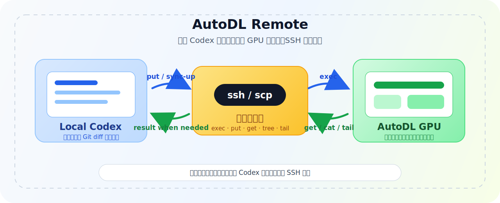
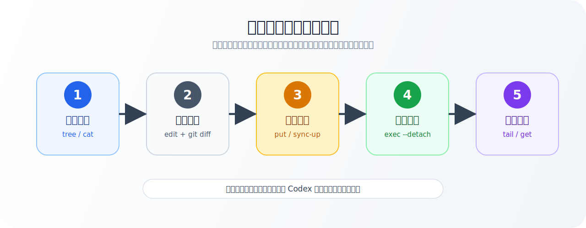
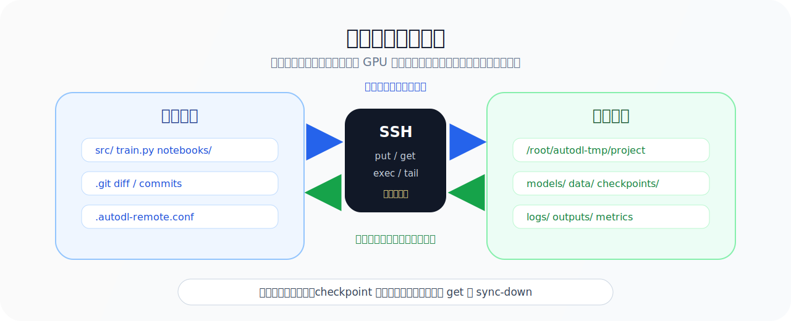

<div align="right">
  中文 | English planned
</div>

<div align="center">
  
  <h1>AutoDL Remote</h1>
  <h3>让 Codex 留在本地，让 GPU 在远端跑</h3>
  <p><em>一个面向 Codex App 的极简 SSH 插件：账号管理、远端命令、显式上传和下载。</em></p>
  <p>
    
    
    
    
    
  </p>
</div>

---

## 🎯 项目介绍

&emsp;&emsp;AutoDL Remote 的目标很直接：**Codex 在本地写代码，远端 GPU 机器负责运行代码；需要什么文件，就显式上传或下载什么文件。**

&emsp;&emsp;做 LLM、深度学习、论文复现实验时，模型权重、数据集、checkpoint 往往都在 AutoDL 这类远端 GPU 环境里。本地电脑不适合下载大模型，直接在远端安装和登录 Codex 又容易遇到代理、浏览器登录、环境配置等问题。

&emsp;&emsp;这个插件选择更简单的路线：远端不需要安装 daemon，不需要运行服务，只要能 SSH 登录即可。Codex 仍然在本地工作，本地保留代码修改痕迹和 Git diff；远端负责执行训练、推理和查看日志。

> **一句话理解：** AutoDL Remote 不是同步框架，而是给 Codex 用的一组 SSH 原语。

## ✨ 核心特性

| 能力 | 说明 |
| --- | --- |
| 🔐 SSH 账号管理 | 支持保存多个远端账号，项目里只引用账号名，不写密码 |
| 📁 项目绑定 | 当前本地目录绑定到一个具体远端目录，例如 `/root/autodl-tmp/my-project` |
| 🖥️ 远端命令 | 用 `exec` 在远端运行训练、推理、环境检查等命令 |
| ⬆️ 显式上传 | 用 `put` 或 `sync-up` 把本地改过的文件送到远端 |
| ⬇️ 显式下载 | 用 `get` 或 `sync-down` 只拉回需要查看或提交的结果 |
| 📜 日志查看 | 用 `tail` 查看远端训练日志，不必下载大文件 |
| 🧩 Codex 友好 | 插件不替你判断同步策略，把决策权留给用户和 Codex |

## 🧠 工作原理

<div align="center">
  
</div>

&emsp;&emsp;典型流程是：先查看远端项目结构，再把需要编辑的脚本拉到本地；Codex 在本地修改后，显式上传对应文件；训练或推理在远端执行；最后只查看日志或拉回必要结果。

<div align="center">
  
</div>

&emsp;&emsp;这个边界很重要：**本地负责代码和修改痕迹，远端负责大模型、数据集、checkpoint 和 GPU 任务。** 插件不会默认下载模型权重，也不会默认把整个远端目录同步回来。

## 📚 目录导航

| 文档 | 内容 |
| --- | --- |
| [插件目录](./plugins/autodl-remote) | Codex App 插件源码 |
| [插件说明](./plugins/autodl-remote/README.md) | CLI 命令和插件内部说明 |
| [设计说明](./docs/design.md) | 为什么做成极简 SSH 工具层 |
| [故障排查](./docs/troubleshooting.md) | 安装、SSH、路径、权限等问题 |
| [更新记录](./CHANGELOG.md) | 版本变化 |

## 🚀 快速开始

### 1. 在 Codex App 里安装

1. Clone 这个仓库。
2. 打开 Codex App。
3. 进入 `插件` 页面。
4. 打开插件来源下拉框，选择 `+ 添加更多`。
5. 选择这个仓库的根目录。

应该选择：

```text
/path/to/autodl-remote
```

不要选择：

```text
/path/to/autodl-remote/plugins/autodl-remote
```

Codex App 会在仓库根目录下读取：

```text
.agents/plugins/marketplace.json
```

添加 marketplace 后，在插件列表里选择 `AutoDL Remote` 并安装/启用。

### 2. 安装 CLI

```bash
./scripts/install-cli.sh
```

默认会创建软链接：

```text
/opt/homebrew/bin/autodl-remote
```

也可以指定安装目录：

```bash
./scripts/install-cli.sh ~/.local/bin
```

### 3. 添加远端账号

密码登录：

```bash
autodl-remote account add autodl-gpu \
  --target root@connect.example.com \
  --port 2222 \
  --auth prompt \
  --default-remote /root/autodl-tmp
```

SSH key 登录：

```bash
autodl-remote account add gpu-key \
  --target root@host \
  --port 22 \
  --key ~/.ssh/id_rsa \
  --auth ssh-key
```

查看和选择账号：

```bash
autodl-remote account list
autodl-remote account use autodl-gpu
autodl-remote account test autodl-gpu
```

### 4. 绑定当前项目

```bash
cd /path/to/local/project
autodl-remote bind --account autodl-gpu --remote /root/autodl-tmp/my-project
autodl-remote doctor
```

项目配置会写入当前目录：

```bash
ACCOUNT="autodl-gpu"
REMOTE_ROOT="/root/autodl-tmp/my-project"
```

密码不会写入项目配置。

## 🛠️ 常用命令

| 命令 | 用途 |
| --- | --- |
| `autodl-remote doctor` | 检查当前项目绑定、SSH 连通性、远端目录 |
| `autodl-remote tree . --depth 2` | 查看远端目录结构 |
| `autodl-remote ls .` | 查看远端目录 |
| `autodl-remote cat -- train.py` | 查看远端文件内容 |
| `autodl-remote get train.py train.py` | 把远端文件拉到本地 |
| `autodl-remote put train.py train.py` | 把本地文件上传到远端 |
| `autodl-remote sync-up ./src src` | 上传本地目录 |
| `autodl-remote sync-down outputs outputs` | 下载远端目录 |
| `autodl-remote exec -- python train.py` | 在远端执行命令 |
| `autodl-remote exec --detach --name train -- python train.py` | 远端后台运行长任务 |
| `autodl-remote tail -- .autodl-remote/logs/train.log` | 查看远端日志 |

## 🧪 典型场景

### 远端已有项目

```bash
autodl-remote tree . --depth 2
autodl-remote cat -- train.py
autodl-remote get train.py train.py

# Codex 在本地修改 train.py
autodl-remote put train.py train.py
autodl-remote exec -- python train.py
```

### 本地已有项目

```bash
autodl-remote bind --account autodl-gpu --remote /root/autodl-tmp/my-project
autodl-remote sync-up ./src src
autodl-remote put train.py train.py
autodl-remote exec -- python train.py
```

### 远端训练任务

```bash
autodl-remote exec --detach --name train -- python train.py
autodl-remote tail -- .autodl-remote/logs/train.log
autodl-remote cat -- outputs/metrics.json
autodl-remote get outputs/metrics.json outputs/metrics.json
```

## ✅ 它不做什么

AutoDL Remote 保持克制，不做这些事：

- 不判断本地或远端谁是 source of truth；
- 不维护 manifest；
- 不自动拉取完整远端项目；
- 不在每次运行前自动推送整个本地项目；
- 不规定你的项目结构；
- 不默认下载模型权重、数据集、checkpoint 或大型输出。

这些决策交给用户和 Codex，因为不同项目的代码组织方式差异很大。

## 🔐 安全与隐私

- 账号配置保存在 `~/.autodl-remote/accounts/`。
- 项目只保存账号名和远端目录。
- 密码不会写进项目文件。
- 可选使用 macOS Keychain 保存密码：

```bash
autodl-remote account password-save autodl-gpu
autodl-remote account password-delete autodl-gpu
```

网络流量只会发往你配置的 SSH 主机。远端命令和文件传输都由本地 CLI 显式触发。

## 📦 仓库结构

```text
.
├── .agents/plugins/marketplace.json
├── plugins/autodl-remote/
│   ├── .codex-plugin/plugin.json
│   ├── bin/autodl-remote
│   ├── config/example.conf
│   ├── skills/autodl-remote/SKILL.md
│   └── README.md
├── docs/
│   ├── design.md
│   ├── troubleshooting.md
│   └── images/
├── scripts/install-cli.sh
├── CHANGELOG.md
├── .gitignore
└── LICENSE
```

## 🤝 贡献

欢迎提交 Issue 或 Pull Request。这个项目会优先保持轻量，不会加入复杂的自动同步策略。如果你想贡献新能力，建议先说明它是否仍然符合三个核心原语：

- SSH 账号管理；
- 远端命令执行；
- 显式上传和下载。

## 📜 License

MIT

<div align="center">
  <p>如果这个项目对你有帮助，欢迎给一个 Star。</p>
</div>
