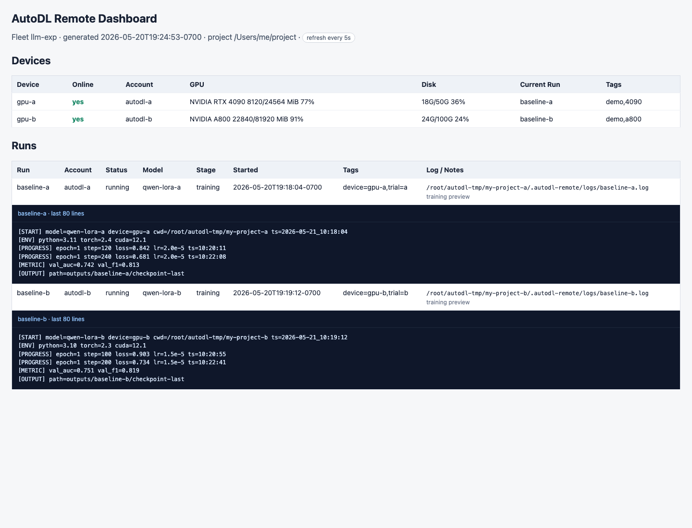

# AutoDL Remote

AutoDL Remote is a thin SSH tool layer for Codex.

It does not decide whether local code or remote code is the source of truth. Codex and the user decide what to inspect, upload, download, and run.

The remote server does not need Codex, Python, a proxy, an OpenAI login, or a daemon.

## Model

The plugin has three primitives:

- SSH account management
- Remote command execution
- File upload/download

Global account config lives in:

```bash
~/.autodl-remote/accounts/
```

Project binding lives in the project root:

```bash
.autodl-remote.conf
```

The project file only stores:

```bash
ACCOUNT="autodl-gpu"
REMOTE_ROOT="/root/autodl-tmp/my-project"
```

Passwords are never written to project files.

## Quick Start

Check the installed CLI version:

```bash
autodl-remote --version
```

Create or choose an account:

```bash
autodl-remote account add autodl-gpu \
  --target root@connect.example.com \
  --port 2222 \
  --auth prompt \
  --default-remote /root/autodl-tmp

autodl-remote account use autodl-gpu
autodl-remote account list
```

Bind the current local directory to a concrete remote directory:

```bash
autodl-remote bind --remote /root/autodl-tmp/my-project
```

Inspect and run:

```bash
autodl-remote doctor
autodl-remote model-dir
autodl-remote tree . --depth 2
autodl-remote exec -- pwd
autodl-remote exec -- python train.py
autodl-remote exec --detach --name train --model baseline --stage training -- python train.py
autodl-remote exec --tmux --name train-live --model baseline --stage training -- PYTHONUNBUFFERED=1 python -u train.py
autodl-remote tmux capture train-live --lines 200
autodl-remote run status train
autodl-remote run tail train
autodl-remote dashboard
```

Move files only when needed:

```bash
autodl-remote put ./train.py train.py
autodl-remote put-run ./train.py -- python train.py
autodl-remote get outputs/result.csv ./outputs/result.csv
autodl-remote sync-up ./src src
autodl-remote sync-down logs/train.log ./logs/train.log
```

Run complex local scripts without shell quoting problems:

```bash
autodl-remote exec --script scripts/remote_check.sh
cat scripts/remote_check.sh | autodl-remote exec --stdin -- bash
```

Shutdown the remote machine after a run:

```bash
autodl-remote shutdown
```

## Fleet and Dashboard

The dashboard is read-only. It shows local run metadata, lightweight remote status from SSH polling, and the latest remote log lines or tmux pane output for recorded runs. It does not stop jobs, delete files, upload, download, or shut down machines.

When `--watch` is enabled, the CLI keeps updating a sidecar `dashboard.state.js` file. The browser polls that file and updates the page in place, so the dashboard can keep scroll position and avoid full-page reloads.



Single-machine dashboard for the current project binding:

```bash
autodl-remote dashboard
autodl-remote dashboard --open
autodl-remote dashboard --open --watch 5 --lines 120
```

Create a project-local fleet:

```bash
autodl-remote fleet create rag-exp
autodl-remote fleet add rag-exp nmb1 --account autodl-nmb1 --remote /root/autodl-tmp/LLM-RAG --tags a800,rag
autodl-remote fleet add rag-exp cqa1 --account autodl-cqa1 --remote /root/autodl-tmp/LLM-RAG --tags 4090,rag
autodl-remote fleet status rag-exp
autodl-remote dashboard --fleet rag-exp --open
autodl-remote dashboard --fleet rag-exp --open --watch 5 --lines 120
```

Run metadata lets the dashboard show what Codex intended to run:

```bash
autodl-remote exec --account autodl-nmb1 --remote /root/autodl-tmp/LLM-RAG \
  --detach --name melu-fold3 --model MeLU --stage training --tag fold=3 \
  --purpose "no-leak 5-fold experiment" -- python train.py model=melu fold=3

autodl-remote run list
autodl-remote run note melu-fold3 --stage predicting --output outputs/melu_fold3.csv
```

For long-running Python jobs, prefer unbuffered logs so the dashboard updates quickly:

```bash
PYTHONUNBUFFERED=1 python -u train.py
```

Useful log markers:

```text
[START] model=... device=... cwd=...
[ENV] python=... cuda=...
[PROGRESS] epoch=... step=... loss=...
[METRIC] val_auc=...
[OUTPUT] path=...
[DONE] exit_code=0
[ERROR] ...
```

## tmux Backend

`tmux` is optional. Normal SSH commands and `exec --detach` still work without it.

Use tmux when you want a long-running remote job to keep a live terminal pane:

```bash
autodl-remote tmux check
autodl-remote exec --tmux --name train-live --model baseline --stage training -- \
  PYTHONUNBUFFERED=1 python -u train.py
autodl-remote tmux capture train-live --lines 200
```

If the remote machine does not have tmux, the plugin will say so explicitly:

```bash
Remote tmux is missing. Please install tmux on the remote machine, or run: autodl-remote tmux install
```

Install tmux only when you actually want this backend:

```bash
autodl-remote tmux install
```

The dashboard reads tmux pane output for tmux-backed jobs and falls back to the recorded log file if the pane is gone.

## Accounts

List accounts:

```bash
autodl-remote account list
```

Show an account without exposing passwords:

```bash
autodl-remote account show autodl-gpu
```

Set the default account:

```bash
autodl-remote account use autodl-gpu
```

Password login is the default for AutoDL:

```bash
autodl-remote account add autodl-gpu --target root@host --port 2222 --auth prompt
```

SSH key login:

```bash
autodl-remote account add gpu-key --target root@host --port 22 --key ~/.ssh/id_rsa --auth ssh-key
```

Optional macOS Keychain password storage:

```bash
autodl-remote account password-save autodl-gpu
```

When an account uses `AUTH="keychain"`, the CLI retrieves the password from macOS Keychain and drives password prompts with `expect`.

## Commands

```bash
autodl-remote account add <name> [--target root@host] [--port 22] [--key path] [--auth prompt|keychain|ssh-key] [--default-remote path]
autodl-remote account list
autodl-remote account show <name>
autodl-remote account use <name>
autodl-remote account test [name]
autodl-remote account password-save <name>
autodl-remote account password-delete <name>

autodl-remote bind [--account name] --remote /remote/project/root
autodl-remote doctor
autodl-remote model-dir [--mkdir]
autodl-remote fleet create <name>
autodl-remote fleet add <fleet> <device> [--account name] [--remote path] [--tags tags]
autodl-remote fleet list
autodl-remote fleet status [fleet]
autodl-remote dashboard [--fleet name] [--output path] [--open] [--watch seconds] [--lines 120]
autodl-remote tmux check [--account name] [--remote path]
autodl-remote tmux install [--account name] [--remote path]
autodl-remote tmux list [--account name] [--remote path]
autodl-remote tmux capture [--account name] [--remote path] [--lines 120] <session>
autodl-remote tmux attach-cmd [--account name] [--remote path] <session>
autodl-remote tmux kill [--account name] [--remote path] <session>

autodl-remote exec [--account name] [--remote path] [--detach|--tmux] [--cwd path] [--name name] [--model name] [--tag k=v] [--stage stage] [--purpose text] [--script local_script] [--stdin] -- <command>
autodl-remote put-run <local-path>... -- <command>
autodl-remote put [--account name] [--remote path] <local-path> [remote-path]
autodl-remote get [--account name] [--remote path] <remote-path> [local-path]
autodl-remote sync-up [--account name] [--remote path] <local-path> [remote-path]
autodl-remote sync-down [--account name] [--remote path] <remote-path> [local-path]
autodl-remote tree [--account name] [--remote path] [remote-path] [--depth 3] [--limit 500]
autodl-remote ls [--account name] [--remote path] [remote-path]
autodl-remote cat [--account name] [--remote path] [--lines 200] -- <remote-path>
autodl-remote tail [--account name] [--remote path] [--lines 120] [--follow] -- <remote-path>
autodl-remote job list
autodl-remote job status <name>
autodl-remote job tail [--lines 120] [--follow] <name>
autodl-remote run submit [metadata/options] -- <command>
autodl-remote run list
autodl-remote run status <name>
autodl-remote run tail [--lines 120] [--follow] <name>
autodl-remote run note <name> [--model name] [--tag k=v] [--stage stage] [--purpose text] [--output path]
autodl-remote shutdown [--wait seconds]
autodl-remote shell
autodl-remote history
```

## Design Rules

- No `local-main` or `remote-main`.
- No manifest.
- No automatic code ownership decision.
- No automatic pull before edit.
- No automatic push before run.
- Use `put/get/sync-up/sync-down` explicitly.
- Keep large models, datasets, checkpoints, and training outputs on AutoDL unless the user explicitly pulls them.
- Use `exec --script` or `exec --stdin` for multi-line shell/Python snippets.
- Use `job status` and `job tail` for detached training jobs created with `exec --detach --name`.
- Use `exec --tmux --name` when live pane output matters, especially for long tasks, parallel runs, or multiple hosts.
- Use `fleet` and `dashboard` for multi-device visibility; the dashboard is display-only.
- Use `dashboard --watch <seconds> --lines <n>` when the user wants to watch remote logs without spending chat tokens.
- Use run metadata flags (`--model`, `--tag`, `--stage`, `--purpose`) when Codex launches experiments so later dashboards are understandable.
- Use `shutdown` instead of guessing provider-specific poweroff commands.
